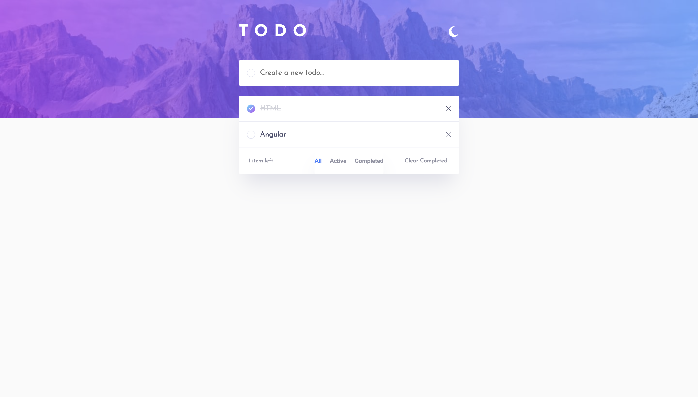
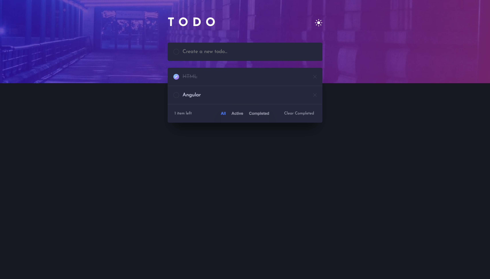

# Todo App (Angular 20 + Signals)


A classic, robust Todo application built with **Angular 20**. This project demonstrates modern Angular architecture, utilizing **Signals** for state management, **Standalone Components**, and a responsive layout that adapts between mobile and desktop views.

<div align="center">
  <a href="https://angular-todo-list-rosy.vercel.app/">
    
  </a>
</div>

## Preview




## Key Features

- **🌗 Dark & Light Mode:** Automatically detects system preference on first load and persists user selection.
- **💾 Local Storage Persistence:** Tasks are saved instantly. Your list is waiting for you even if you refresh or close the browser.
- **⚡ Angular Signals:** State management is handled purely with Signals (`signal`, `computed`, `effect`) for granular reactivity and high performance.
- **📱 Fully Responsive:**
  - **Desktop:** Filters appear inside the card footer.
  - **Mobile:** Filters adapt to a separate floating container for easier touch access.
- **🔍 Filtering:** Filter tasks by "All", "Active", or "Completed".
- **🔢 Smart Counter:** Dynamic "Items Left" counter that tracks active tasks regardless of the current view.

## 🛠️ Tech Stack & Architecture

This project strictly follows the **Smart vs. Dumb Component** architecture pattern to ensure maintainability and scalability.

- **Framework:** Angular 19/20 (Standalone Components)
- **Language:** TypeScript
- **Styling:** SCSS (with CSS Variables for theming)
- **State Management:** `TodoService` (Signal-based store)

## Development server

To start a local development server, run:

```bash
ng serve
```

Once the server is running, open your browser and navigate to `http://localhost:4200/`. The application will automatically reload whenever you modify any of the source files.

## Code scaffolding

Angular CLI includes powerful code scaffolding tools. To generate a new component, run:

```bash
ng generate component component-name
```

For a complete list of available schematics (such as `components`, `directives`, or `pipes`), run:

```bash
ng generate --help
```

## Building

To build the project run:

```bash
ng build
```

This will compile your project and store the build artifacts in the `dist/` directory. By default, the production build optimizes your application for performance and speed.

## Running unit tests

To execute unit tests with the [Karma](https://karma-runner.github.io) test runner, use the following command:

```bash
ng test
```

## Running end-to-end tests

For end-to-end (e2e) testing, run:

```bash
ng e2e
```

Angular CLI does not come with an end-to-end testing framework by default. You can choose one that suits your needs.
